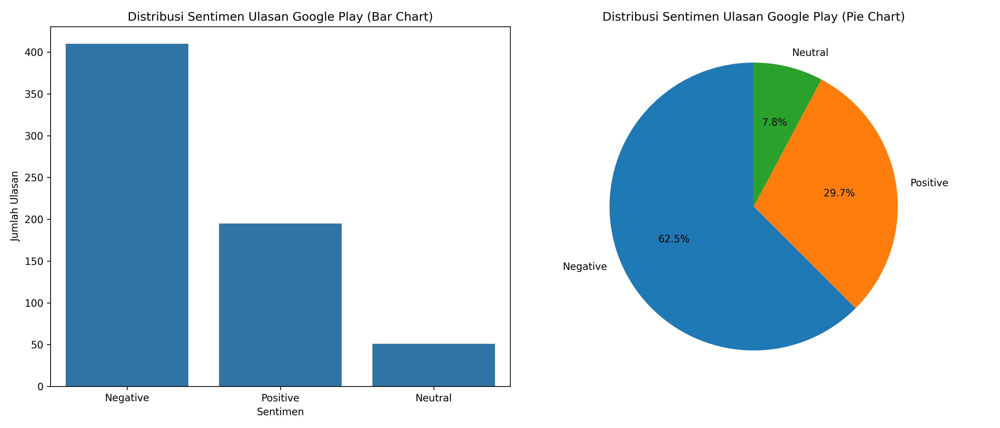

# 📊 Scraper Ulasan Google Play Store

Project ini dibuat untuk mengambil data ulasan aplikasi dari Google Play Store menggunakan Python di Google Colab.

## 📱 Aplikasi yang Dianalisis

Aplikasi yang digunakan:

- **Nama aplikasi:** SI D'nOK - Kota Semarang
- **App ID:** semarangkota.sidnok

## 🛠️ Library yang Digunakan

- google-play-scraper
- pandas
- matplotlib
- seaborn

## 📂 Data yang Diambil

Data ulasan yang diambil dari Google Play Store meliputi:

- userName
- score
- at
- content
- Sentimen

## 📈 Metode Analisis Sentimen

Analisis sentimen dilakukan berdasarkan rating ulasan:

- **Positive (Positif):** Rating 4 sampai 5 😃
- **Neutral (Netral):** Rating 3 😐
- **Negative (Negatif):** Rating 1 sampai 2 😡

## 📁 Output File

Project ini menghasilkan file:

- ulasan_google_play.csv
- distribusi_sentimen_ulasan_google_play.png
- uts-big-data.ipynb

**Contoh Visualisasi Hasil Sentimen:**

## 💡 Kesimpulan

Data ulasan Google Play Store berhasil diambil, disimpan dalam format CSV, dan divisualisasikan dalam bentuk bar chart serta pie chart.
